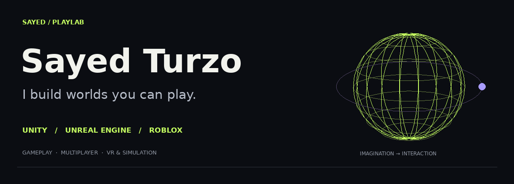
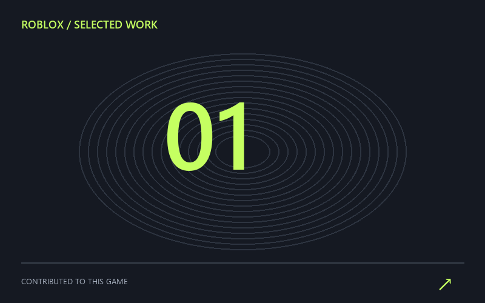
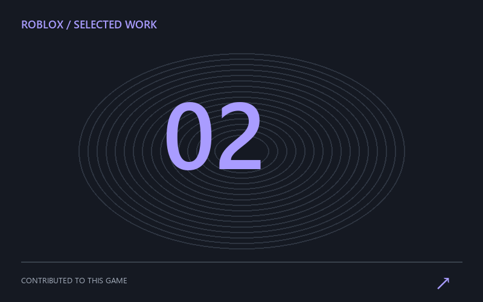
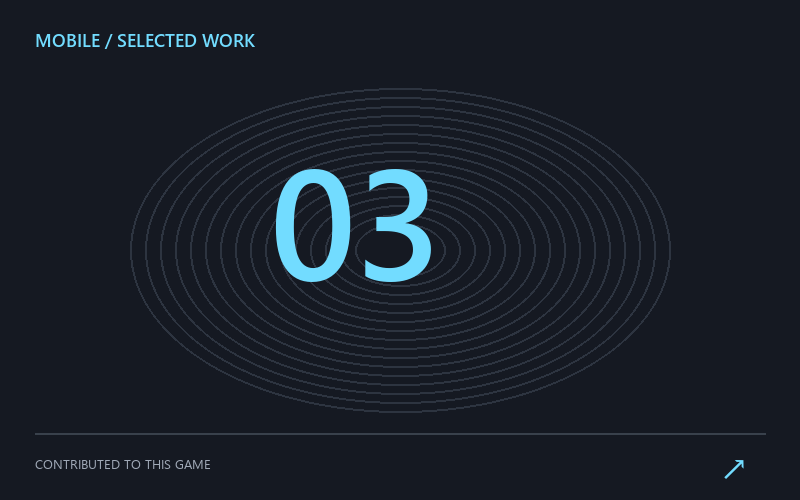

<!-- Generated by scripts/build_profile.py. Edit profile.json, then rebuild. -->

<strong>Unity · Unreal Engine · Roblox · Multiplayer · VR</strong>

Game developer working across Unity, Unreal Engine and Roblox. Gameplay, multiplayer worlds, VR simulations — and the systems that bring them to life.

<a href="https://sayedturzo.github.io/SayedTurzo/#arcade">▶ PLAY NEON SNAKE</a> &nbsp; / &nbsp; <a href="https://sayedturzo.github.io/SayedTurzo/">EXPLORE MY WORK ↗</a> &nbsp; / &nbsp; <a href="mailto:abusayedbinabdullah@gmail.com">LET’S TALK ↗</a>

## Selected work

Games I’ve worked on — Roblox worlds, mobile games, and interactive experiences.

<table><tr>

<td width="33%" valign="top"> ROBLOX <strong>Clean a Crime</strong>  <a href="https://www.roblox.com/games/126295191500786/Clean-a-Crime">Visit game ↗</a></td>

<td width="33%" valign="top"> ROBLOX <strong>OMG! This Place Is DISGUSTING</strong>  <a href="https://www.roblox.com/games/81057871278887/OMG-This-Place-Is-DISGUSTING">Visit game ↗</a></td>

<td width="33%" valign="top"> MOBILE <strong>Spaceholic!</strong>  <a href="https://play.google.com/store/apps/details?id=com.medievilstudio.spaceholic">Visit game ↗</a></td>

</tr></table>

| More games | Platform |

| :--- | :--- |

| [Burgerology ↗](https://play.google.com/store/apps/details?id=com.medievil.burgerology) | Mobile |

| [Shark Attack ↗](https://play.google.com/store/apps/details?id=com.fpg.sharkattack) | Mobile |

| [War Troops 1917 ↗](https://play.google.com/store/apps/details?id=com.wartroops1917.trench.warfare) | Mobile |

## The toolkit

<table><tr>

<td valign="top"><strong>Engines &amp; platforms</strong>  Unity Unreal Engine Roblox</td>

<td valign="top"><strong>Code</strong>  C# C++ Python JavaScript</td>

<td valign="top"><strong>Multiplayer &amp; backend</strong>  Photon FishNet Mirror WebRTC Firebase PlayFab AWS</td>

<td valign="top"><strong>Creative &amp; workflow</strong>  Blender Figma Git Shaders VR Optimization</td>

</tr></table>

## Built beyond the screen

**[Met City ↗](https://metcity.xyz/)** · Unity · WebGL · Multiplayer · AWS   

**[E-Gold City ↗](https://metaverse.egold.farm/)** · Unity · Metaverse · Interactive worlds   

**[Nanoverse ↗](https://nanoverse.io/)** · Unity · Virtual worlds · Interactive systems   

## A little less scrolling. A little more playing.

**[Play Neon Snake →](https://sayedturzo.github.io/SayedTurzo/#arcade)** — keyboard, touch controls, and a personal best. Runs on the companion page.

## Contribution trail

<picture><source media="(prefers-color-scheme: dark)" srcset="assets/contributions-dark.svg"></picture>

<a href="https://sites.google.com/view/sayedturzo/">Portfolio</a> · <a href="https://www.linkedin.com/in/sayedturzo/">LinkedIn</a> · <a href="mailto:abusayedbinabdullah@gmail.com">Email</a>

