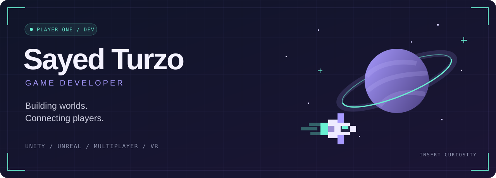

  

  <strong>Unity & Unreal Engine · Multiplayer · VR & Simulation</strong> 
  I turn ideas into playable experiences, from mobile games to connected virtual worlds.

  <a href="https://medievilstudio.itch.io/against-the-dawn-3d-webgl"><strong>▶ PLAY A GAME</strong></a>
  &nbsp; / &nbsp;
  <a href="https://sites.google.com/view/sayedturzo/"><strong>◈ PORTFOLIO</strong></a>
  &nbsp; / &nbsp;
  <a href="mailto:abusayedbinabdullah@gmail.com"><strong>✉ GET IN TOUCH</strong></a>

---

## 01 / Player select

Hey, I'm **Sayed Turzo** — a game developer and software engineer.

I work on the systems that make a world feel alive: gameplay, multiplayer networking, NPC behaviour, VR interactions, shaders, and performance. I enjoy turning complex technical challenges into experiences players can jump straight into.

| Gameplay | Connected worlds | Immersive experiences |
| :--- | :--- | :--- |
| Mobile games, mechanics, NPC systems | Multiplayer networking, WebGL, dedicated servers | VR interactions, simulations, real-time applications |

## 02 / Choose your next adventure

Games I've worked on. Pick a title to visit its game page.

| Game | Destination |
| :--- | :--- |
| 🌅 **Against The Dawn** | [▶ Explore on itch.io](https://medievilstudio.itch.io/against-the-dawn-3d-webgl) · WebGL |
| 🚀 **Spaceholic!** | [View on Google Play ↗](https://play.google.com/store/apps/details?id=com.medievilstudio.spaceholic) |
| 🍔 **Burgerology** | [View on Google Play ↗](https://play.google.com/store/apps/details?id=com.medievil.burgerology) |
| 🦈 **Shark Attack** | [View on Google Play ↗](https://play.google.com/store/apps/details?id=com.fpg.sharkattack) |
| ⚔️ **War Troops 1917** | [View on Google Play ↗](https://play.google.com/store/apps/details?id=com.wartroops1917.trench.warfare) |

## 03 / World map

Beyond standalone games, I've worked on multiplayer and metaverse experiences.

| World | Focus | Explore |
| :--- | :--- | :--- |
| **Met City** | Unity · WebGL · Multiplayer networking · AWS | [Visit world ↗](https://metcity.xyz/) |
| **E-Gold City** | Unity · Metaverse systems · Interactive worlds | [Visit world ↗](https://metaverse.egold.farm/) |
| **Nanoverse** | Unity · Virtual worlds · Interactive systems | [Visit world ↗](https://nanoverse.io/) |

## 04 / Open the inventory

<strong>🧰 Loadout — engines, languages & tools</strong>

 

| Slot | Equipped |
| :--- | :--- |
| **Engines** | Unity · Unreal Engine |
| **Languages** | C# · C++ · Python |
| **Networking** | Photon · FishNet · Mirror · WebRTC |
| **Backend & services** | Firebase · PlayFab · Amazon AWS |
| **Creative & workflow** | Blender · Figma · Adobe tools · Git |
| **Web** | HTML · CSS · JavaScript |

<strong>💼 Quest log — professional experience</strong>

 

**Game Developer · MediEvil Studio** 
Mobile games, multiplayer systems, metaverse experiences, Unity shaders, and optimization.

**Unity Developer · Next IT LTD.** 
Interactive mini games, API integration, UI animations, and gameplay performance.

**Senior Game Developer · Supertal Pte. Ltd.** 
Multiplayer features, FSM-based NPC systems, Firebase, and PlayFab integration.

**Senior Game Developer · Royex Technologies** 
Multiplayer metaverse systems, dedicated game servers, and WebGL projects.

**Senior Unity Developer · March Robotics And IT Solutions** 
VR simulations, interaction systems, and database integration.

<strong>🔬 Skill tree — what I'm exploring</strong>

 

- Advanced multiplayer architecture and real-time networking
- Unreal Engine development
- Immersive simulation technologies
- Game performance optimization

## 05 / Join the party

Interested in building a game, a multiplayer world, or an interactive simulation?

**[Portfolio ↗](https://sites.google.com/view/sayedturzo/)** &nbsp; · &nbsp;
**[LinkedIn ↗](https://www.linkedin.com/in/sayedturzo/)** &nbsp; · &nbsp;
**[Email me ↗](mailto:abusayedbinabdullah@gmail.com)**

---

  BUILD WORLDS. CONNECT PLAYERS. MAKE IT PLAYABLE. 
  Thanks for dropping into my corner of the internet.

