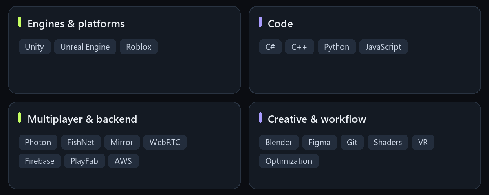
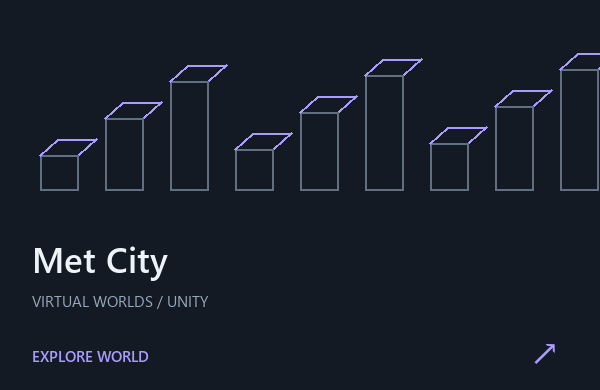
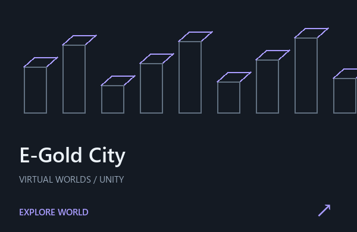
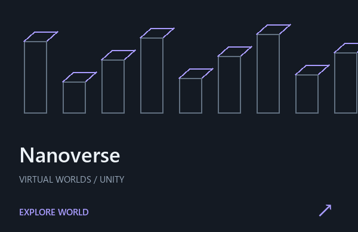

<!-- Generated by scripts/build_profile.py. Edit profile.json, then rebuild. -->

<strong>Unity · Unreal Engine · Roblox · Multiplayer · VR</strong>

Game developer working across Unity, Unreal Engine and Roblox. Gameplay, multiplayer worlds, VR simulations — and the systems that bring them to life.

<a href="https://sites.google.com/view/sayedturzo/">PORTFOLIO ↗</a> &nbsp; / &nbsp; <a href="mailto:abusayedbinabdullah@gmail.com">LET’S TALK ↗</a>

## Games I’ve worked on

<strong>More mobile games</strong>  <a href="https://play.google.com/store/apps/details?id=com.medievilstudio.spaceholic">Spaceholic! ↗</a> &nbsp; · &nbsp; <a href="https://play.google.com/store/apps/details?id=com.medievil.burgerology">Burgerology ↗</a> &nbsp; · &nbsp; <a href="https://play.google.com/store/apps/details?id=com.fpg.sharkattack">Shark Attack ↗</a> &nbsp; · &nbsp; <a href="https://play.google.com/store/apps/details?id=com.wartroops1917.trench.warfare">War Troops 1917 ↗</a>

## What I build with

## Multiplayer worlds & immersive experiences

## Neon Snake

The browser game is built. Public access will appear here after GitHub Pages deployment is verified. [Deployment setup →](CUSTOMIZE.md#make-it-live-on-github)

## Contribution trail

<picture><source media="(prefers-color-scheme: dark)" srcset="assets/contributions-dark.svg"></picture>

<a href="https://sites.google.com/view/sayedturzo/">Portfolio</a> · <a href="https://www.linkedin.com/in/sayedturzo/">LinkedIn</a> · <a href="mailto:abusayedbinabdullah@gmail.com">Email</a>

